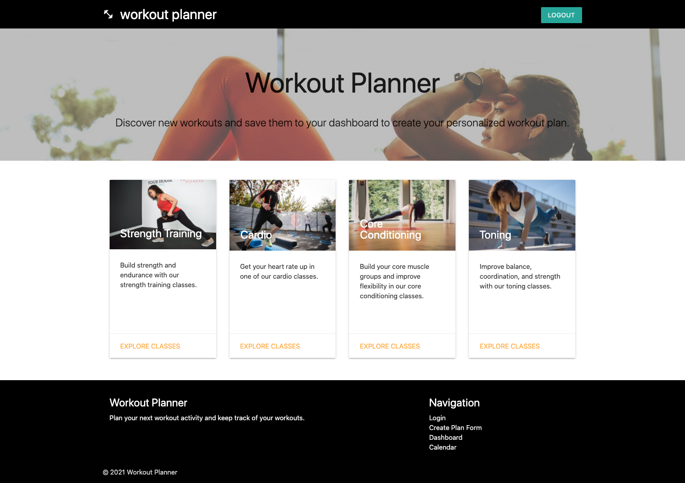

# Workout Planner

As a person who wants to workout using an on-demand class website, I want an application that helps schedule workout plans so that I can have variety and track which plan I like best.

**Link to GitHub Repo:** https://github.com/amiedawn/workout-planner

**Link to Heroku:** tbd

## Description

When you visit the site, you’ll see four categories of workout classes available: Strength Training, Cardio, Core Conditioning, and Toning. Click on “Explore Classes” on a specific category card and you’ll be prompted to create an account or log into your existing account.

After signing in, you’ll see a list of available classes in each category. Select the classes that interest you to add to your workout plan.

Then, visit your dashboard to see all the workout plans you selected.
There is a link on the dashboard to a page that allows you to edit or delete a plan, comment on a plan and view all comments related to the selected plan.

You can also view your calendar to see scheduled classes by day, week or month.

## Installation

The command that should be run to install dependencies is npm i.

## Contributing

No contributions are needed on this project.

## Credits

The creators or this project are:

- [Racheal Colbert](https://github.com/rachealcolbert)
- [Ann Markham](https://github.com/AnnMarkham)
- [Amie Carroll](https://github.com/amiedawn)
- [Alan Mayer](https://github.com/AlanM09)
